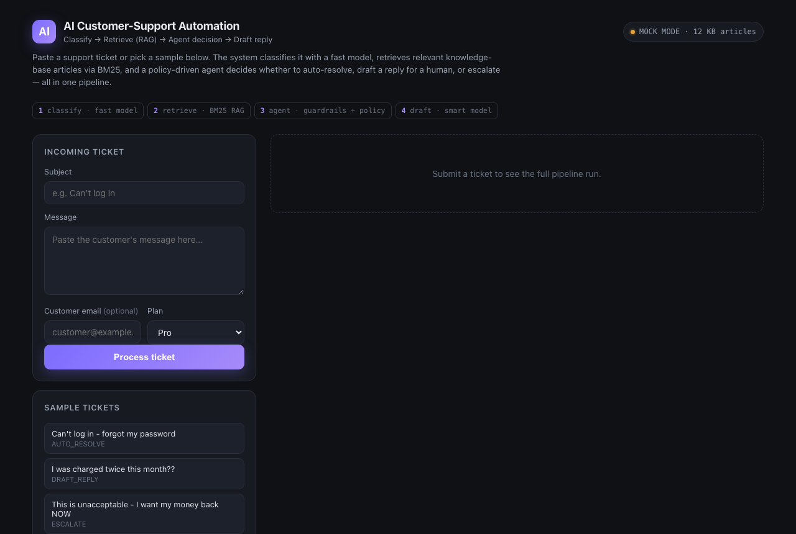
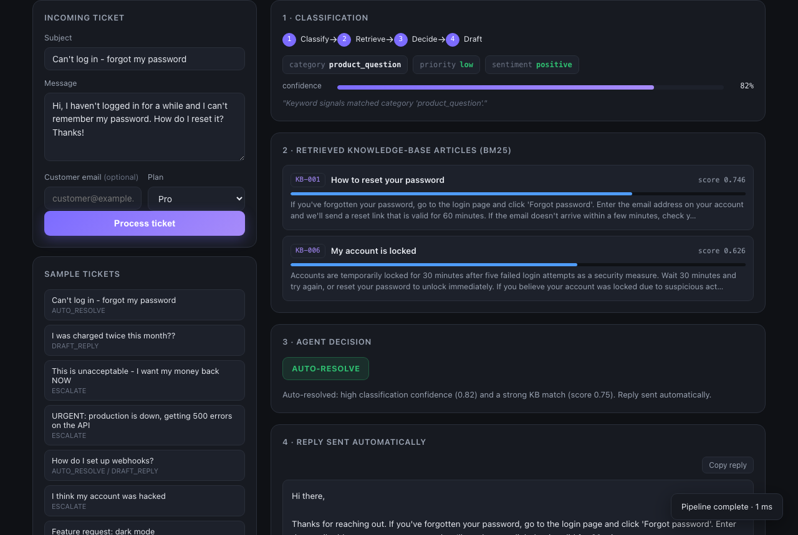
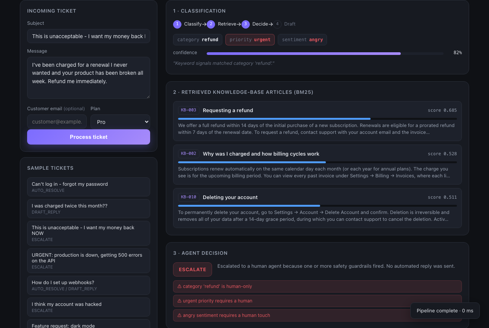
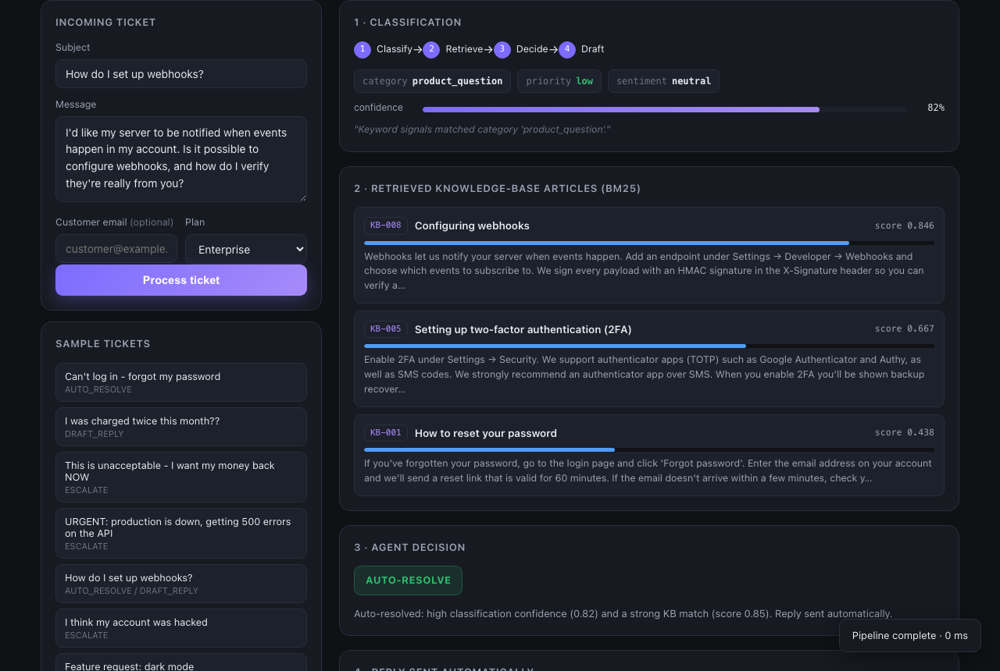
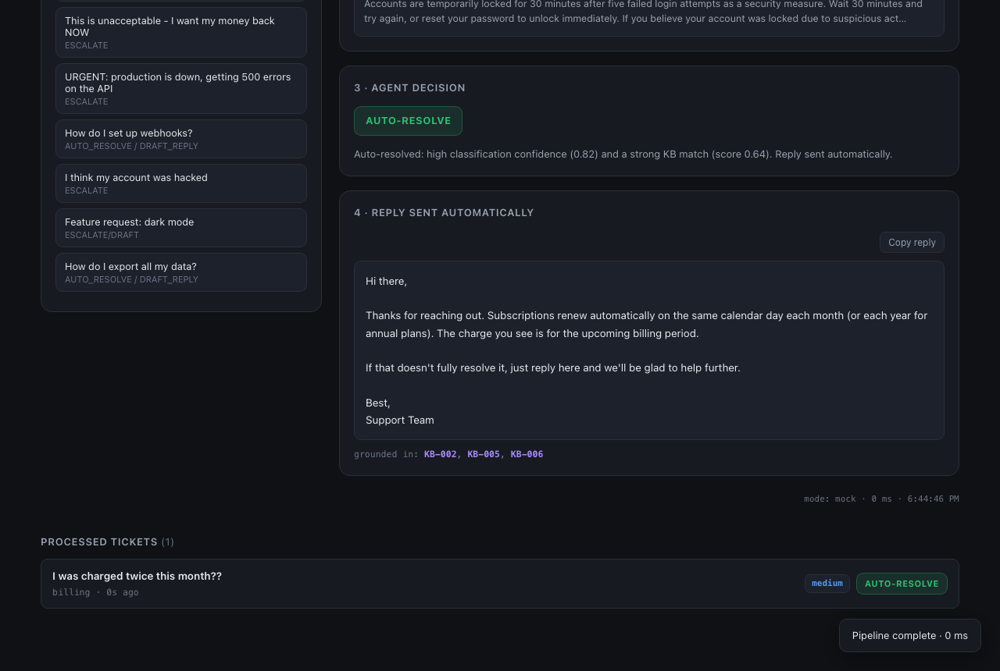
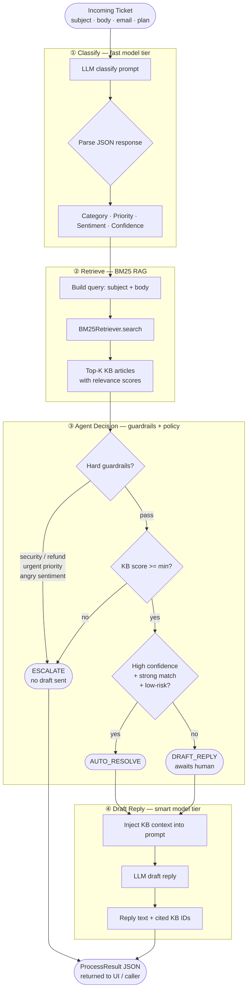

# AI Customer-Support Automation

A fully working **multi-stage AI pipeline** that classifies incoming support tickets, retrieves relevant knowledge-base articles (RAG), makes a policy-driven agent decision, and drafts a grounded customer reply — all in one HTTP call.

Built as a prototype / POC for the **AI Researcher / AI Innovation Engineer** assignment from Webvory.

> **No API key required.** The system runs in deterministic `MOCK` mode out of the box. Drop in an Anthropic, OpenAI, or Gemini key to switch to `LIVE` mode instantly.

---

## Screenshots

| Home | Auto-resolve | Escalate |
|------|-------------|----------|
|  |  |  |

| Draft reply | Ticket history |
|-------------|----------------|
|  |  |

---

## Pipeline Architecture



---

## Features

- **4-stage pipeline** — Classify → Retrieve → Decide → Draft, fully observable in the UI
- **Three-provider LLM support** — Anthropic (Claude), OpenAI (GPT), Google (Gemini); auto-detected from env
- **MOCK mode** — deterministic keyword classifier + templated drafter, zero API cost, fully offline
- **BM25 RAG** — pure-Python Okapi BM25 over a 12-article JSON knowledge base, no vector database needed
- **Policy-driven agent** — hard guardrails (security, refund, urgent, angry) always win over model confidence
- **Ticket history** — last 20 processed tickets shown in-page, clickable to restore
- **Copy reply** — one-click clipboard copy of the drafted reply
- **Batch endpoint** — `POST /api/batch` processes up to 20 tickets in one call
- **CORS-enabled** — ready for n8n, Make, or any external frontend to call
- **14 passing tests** — covers retriever, classifier contract, all 3 agent branches, and end-to-end

---

## Quick Start

```bash
# 1. Clone and install
git clone <repo-url>
cd support-automation
pip install -r requirements.txt

# 2. (Optional) add an API key for live mode
cp .env.example .env
# edit .env and uncomment ANTHROPIC_API_KEY / OPENAI_API_KEY / GEMINI_API_KEY

# 3. Run
uvicorn app.main:app --reload

# 4. Open the demo UI
open http://localhost:8000
```

The health badge in the top-right shows `MOCK MODE` or `LIVE · <provider>`.

---

## API Reference

| Method | Path | Description |
|--------|------|-------------|
| `GET` | `/` | Demo web UI |
| `GET` | `/api/health` | Mode, provider, KB article count |
| `GET` | `/api/samples` | 8 sample tickets for the UI |
| `POST` | `/api/process` | Run the full pipeline on one ticket |
| `POST` | `/api/batch` | Run the pipeline on up to 20 tickets |
| `POST` | `/api/classify` | Classification stage only |
| `GET` | `/api/search?q=...` | BM25 retrieval stage only |

### `POST /api/process` — request body

```json
{
  "subject": "Can't log in",
  "body": "I forgot my password, how do I reset it?",
  "customer_email": "alice@example.com",
  "customer_plan": "pro"
}
```

### `POST /api/process` — response

```json
{
  "ticket": { "subject": "...", "body": "...", "customer_plan": "pro" },
  "classification": {
    "category": "account",
    "priority": "medium",
    "sentiment": "neutral",
    "confidence": 0.82,
    "reasoning": "Keyword signals matched category 'account'."
  },
  "retrieved": [
    { "doc_id": "KB-001", "title": "How to reset your password", "score": 0.749 }
  ],
  "decision": {
    "action": "auto_resolve",
    "rationale": "Auto-resolved: high classification confidence (0.82) ...",
    "triggered_guardrails": [],
    "requires_human": false
  },
  "draft": {
    "text": "Hi there,\n\nThanks for reaching out. ...",
    "cited_doc_ids": ["KB-001", "KB-006"]
  },
  "mode": "mock",
  "latency_ms": 1
}
```

---

## Project Structure

```
support-automation/
├── app/
│   ├── main.py          # FastAPI app, all endpoints
│   ├── pipeline.py      # Orchestrates the 4-stage pipeline
│   ├── classifier.py    # Stage 1 — LLM classification
│   ├── rag.py           # Stage 2 — BM25 retriever
│   ├── agent.py         # Stage 3 — guardrails + policy decision
│   ├── responder.py     # Stage 4 — grounded reply drafter
│   ├── llm_client.py    # Unified LLM client (Anthropic/OpenAI/Gemini/Mock)
│   ├── config.py        # Settings, provider configs, model tiers
│   └── schemas.py       # Pydantic models for the full pipeline
├── data/
│   ├── knowledge_base.json   # 12 KB articles (the RAG corpus)
│   └── sample_tickets.json   # 8 demo tickets
├── static/
│   └── index.html       # Self-contained demo UI (no build step)
├── tests/
│   └── test_pipeline.py # 14 pytest tests, all MOCK mode
├── docs/
│   ├── architecture.md
│   ├── DEMO_WALKTHROUGH.md
│   └── screenshots/     # 5 pipeline-state screenshots
├── scripts/
│   └── take_screenshots.py
├── RESEARCH.md          # Part 1 — tool comparison
├── REPORT.md            # Part 3 — recommendation report
├── .env.example
└── requirements.txt
```

---

## Running Tests

```bash
pytest -q
# 14 passed in 0.1s
```

All tests run in MOCK mode — no API key, no network, fully deterministic.

---

## LLM Providers & Models

| Provider | Fast model (classify) | Smart model (draft) | Fast cost / 1M tok |
|----------|-----------------------|---------------------|--------------------|
| **Anthropic** | `claude-haiku-4-5-20251001` | `claude-sonnet-4-6` | $1 in / $5 out |
| **OpenAI** | `gpt-4o-mini` | `gpt-4o` | $0.15 in / $0.60 out |
| **Google** | `gemini-2.0-flash-lite` | `gemini-2.5-pro` | $0.075 in / $0.30 out |

The two-tier split (cheap model for classification, stronger model for drafting) is the core cost-optimization lever. See `REPORT.md` for the full cost analysis.

---

## Agent Decision Logic

```
if category in (security, refund)  →  ESCALATE  [hard guardrail]
if priority == urgent              →  ESCALATE  [hard guardrail]
if sentiment == angry              →  ESCALATE  [hard guardrail]
if top_kb_score < 0.18             →  ESCALATE  [weak retrieval]
if confidence >= 0.75
   AND top_kb_score >= 0.55
   AND priority in (low, medium)
   AND category not in (feature_request)
                                   →  AUTO_RESOLVE
else                               →  DRAFT_REPLY
```

Thresholds are configurable in `app/config.py` (`Settings` dataclass) without touching any logic code.

---

## Part 1 — Research Summary

See [`RESEARCH.md`](RESEARCH.md) for the full comparison of OpenAI, Claude, Gemini, LangChain, CrewAI, n8n, Pinecone, and Weaviate across capabilities, pricing, scalability, and limitations.

## Part 3 — Recommendation Report

See [`REPORT.md`](REPORT.md) for recommended production architecture, infrastructure cost estimate, scaling strategy, and risk analysis.
