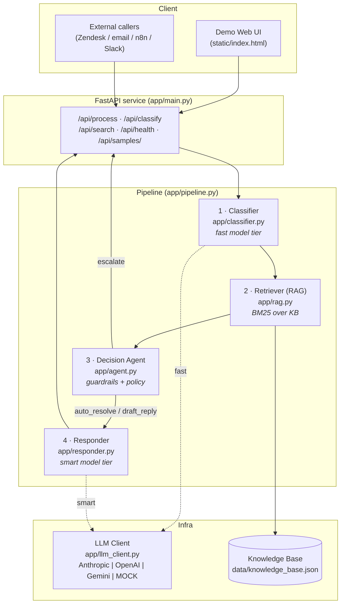
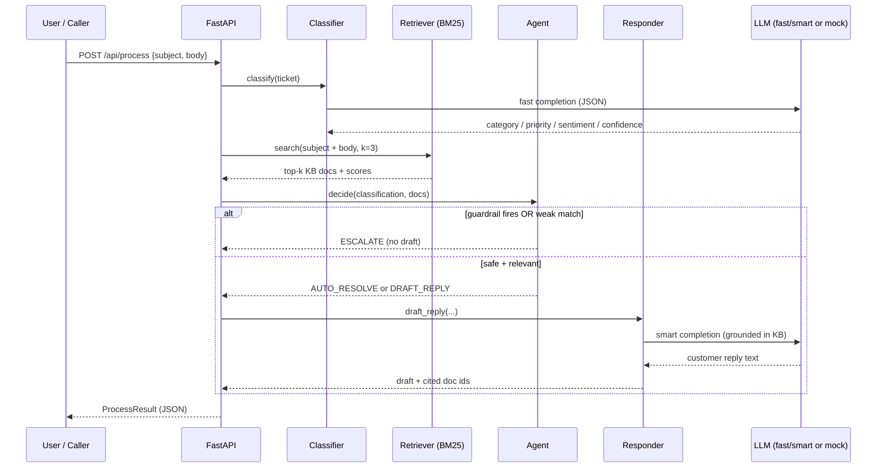
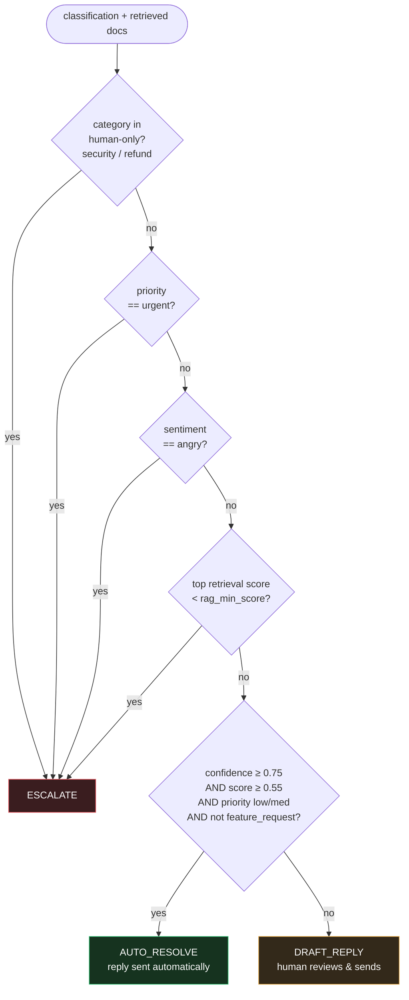
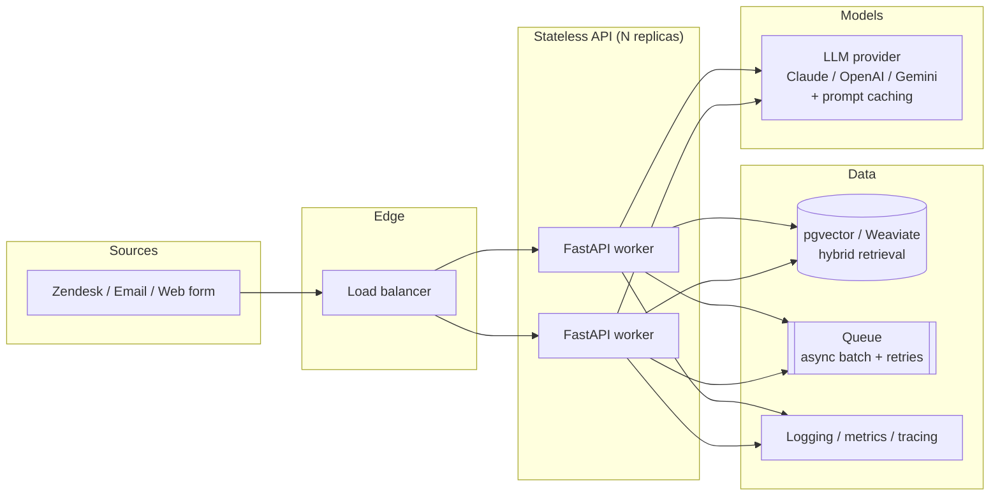

# Architecture & Workflow Diagrams

All diagrams are written in Mermaid and render automatically on GitHub.

## 1. System architecture

## 2. Request sequence (one ticket)

## 3. Agent decision policy

**Guardrails-first design:** the three red branches are deterministic and always
win. The system can never auto-send a reply on a security report, a refund
dispute, an urgent ticket, or an angry customer — regardless of model confidence.
Only inside the space the guardrails allow do confidence and retrieval quality
decide how much autonomy to take.

## 4. Production deployment (target)

